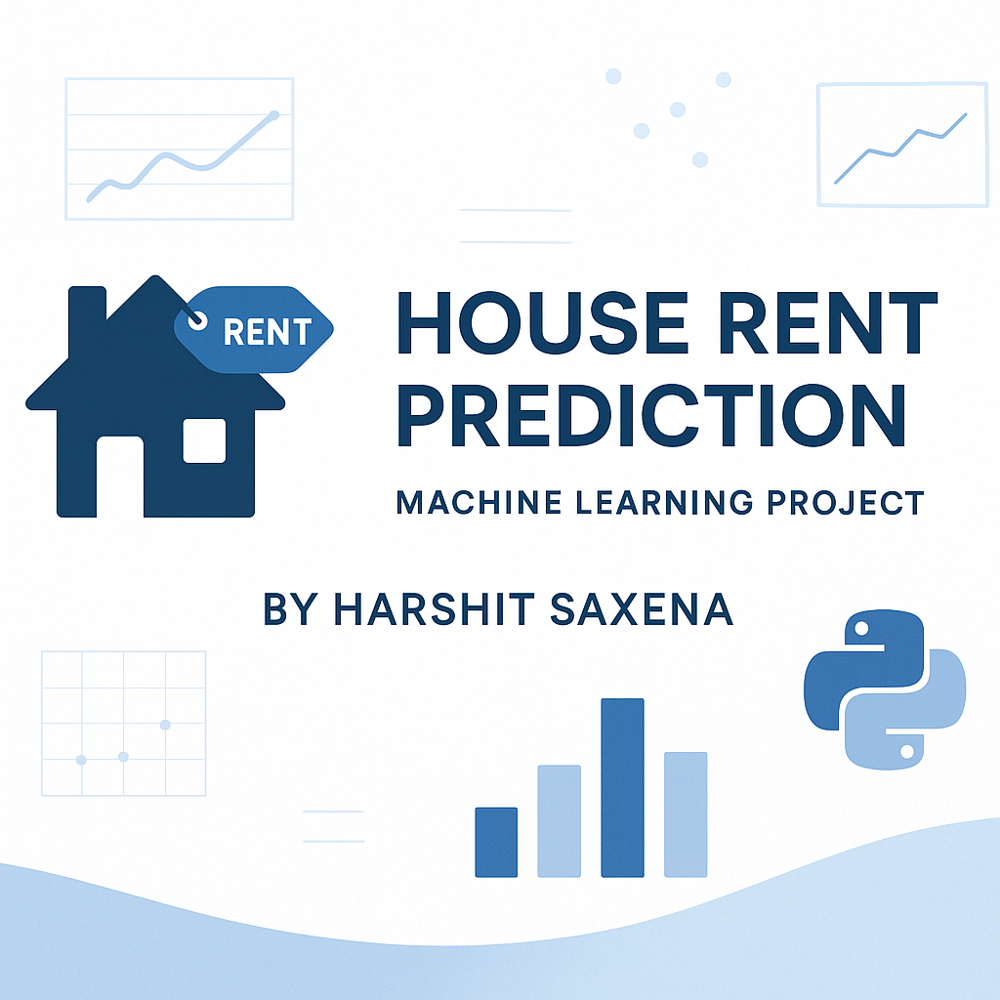

# 🏠 House Rent Prediction

A Data Science project to predict **house rental prices** based on multiple features such as size, city, furnishing status, and more. This project involves **data preprocessing**, **exploratory data analysis (EDA)**, and **model building** using **Linear Regression** and **Random Forest Regressor** in Python.

---

## 📌 Project Objectives

- Predict rent prices based on various property features
- Perform exploratory analysis to uncover insights from the dataset
- Train and compare different regression models
- Evaluate model performance using R² Score and RMSE

---

## 🔧 Tech Stack

- **Language**: Python
- **Libraries**:
  - Pandas
  - NumPy
  - Matplotlib
  - Seaborn
  - Scikit-learn

---

## 📊 Workflow Summary

1. **Data Preprocessing**  
   - Handling null values  
   - Converting data types  
   - Encoding categorical variables

2. **EDA (Exploratory Data Analysis)**  
   - Distribution plots  
   - Box plots & outlier detection  
   - Correlation heatmaps

3. **Model Training & Evaluation**  
   - Linear Regression  
   - Random Forest Regressor  
   - R² Score, RMSE

---

## 📁 Dataset

- `house_rent_data.csv`  
  The dataset contains features like:
  - Size (in BHK)
  - Rent (target)
  - Area Type
  - City
  - Furnishing Status
  - Tenant Type
  - Bathroom Count

---

## ✅ Results

- Built and evaluated models using R² Score and RMSE
- Random Forest showed improved performance over basic Linear Regression
- Derived insights on rental trends based on city and furnishing status

---

## 👨‍💻 Author

**Harshit Saxena**  
B.Tech CSE | Maharaja Surajmal Institute of Technology, Delhi  
- 📧 harshitsaxenavs@gmail.com  
- 🌐 [LinkedIn](https://www.linkedin.com/in/harshit-saxena-vs/)  
- 💻 [GitHub](https://github.com/harshitsaxenavs)

---

## ❗ License

This project is **not open-source**. All rights are reserved by the author.  
Unauthorized copying, modification, or distribution is strictly prohibited.
